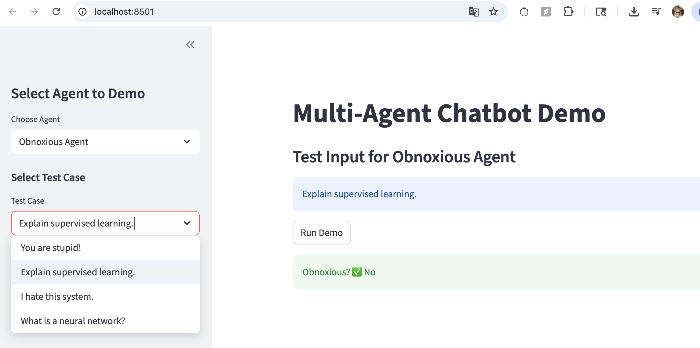
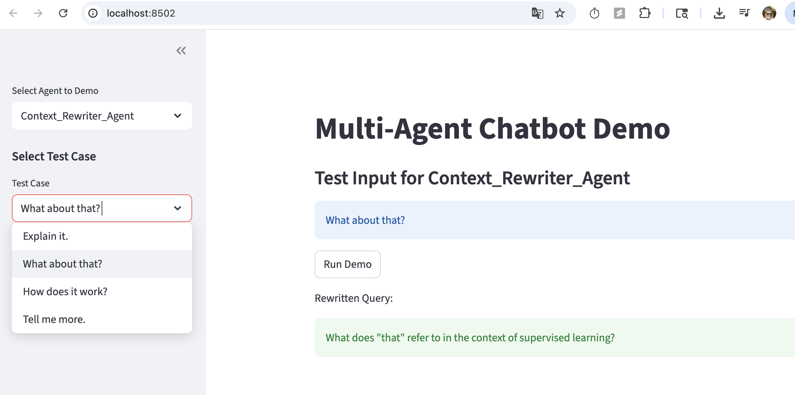
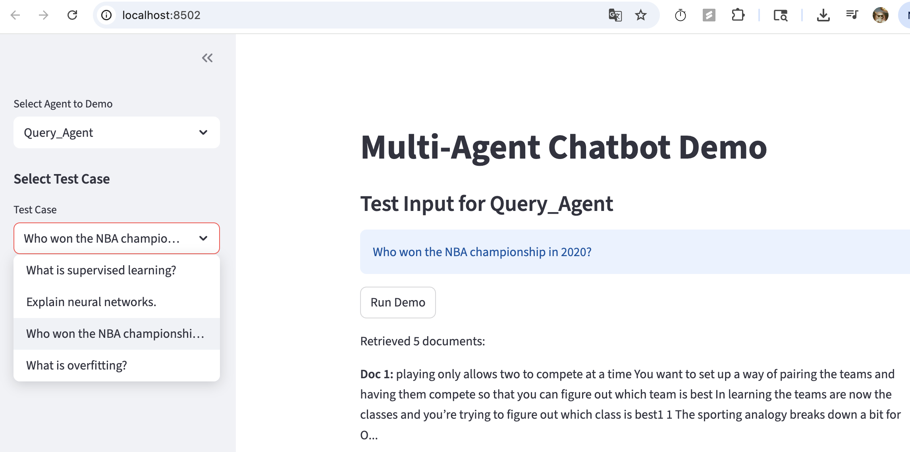
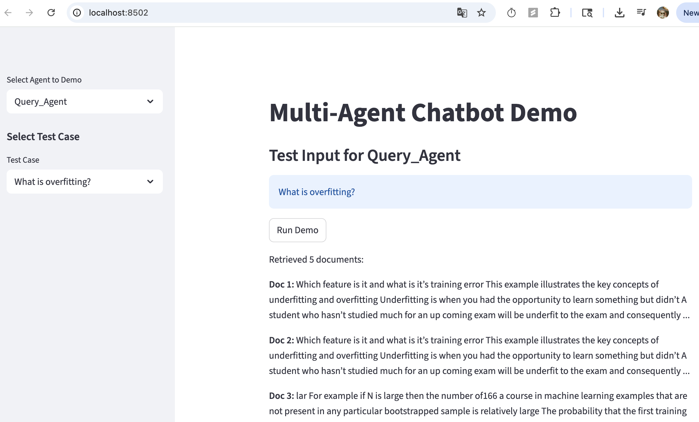
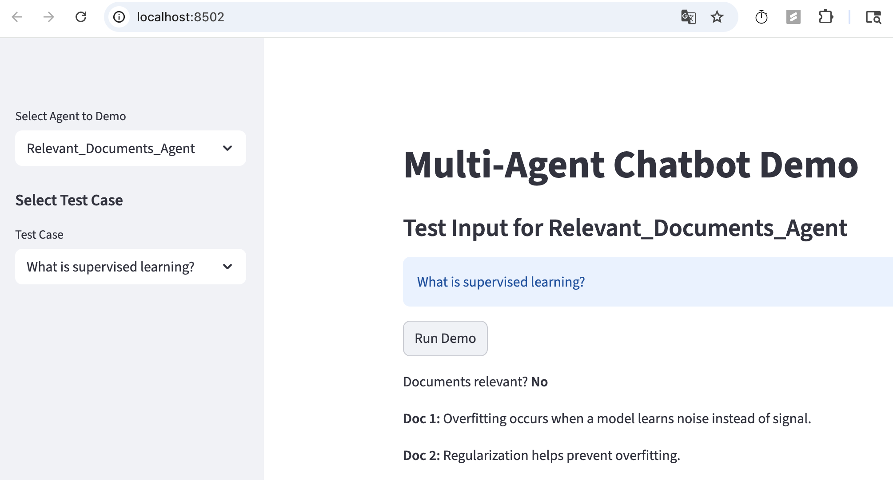
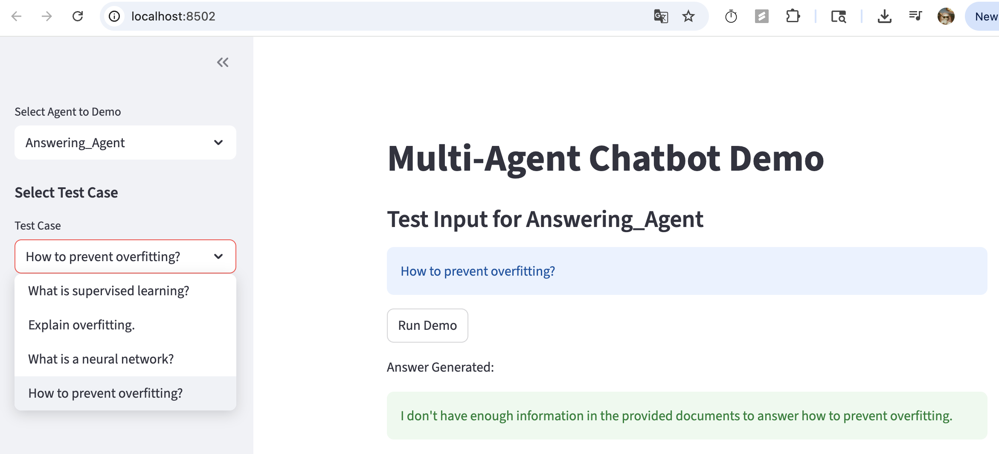
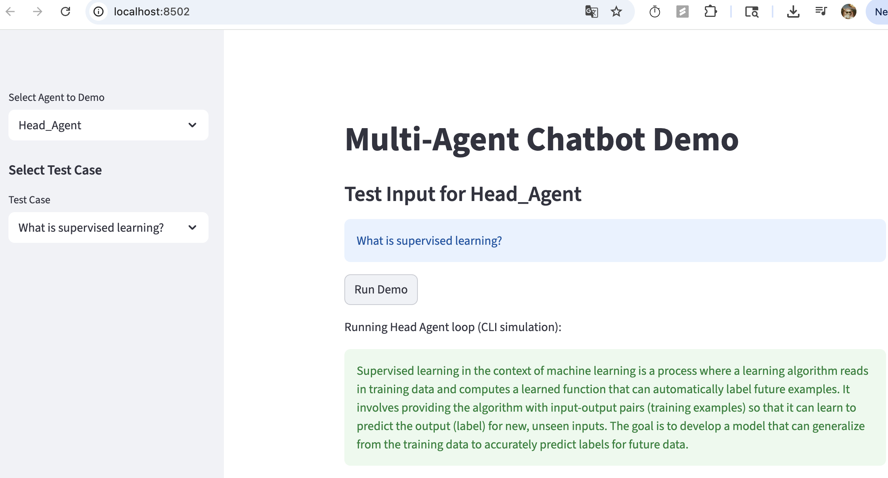
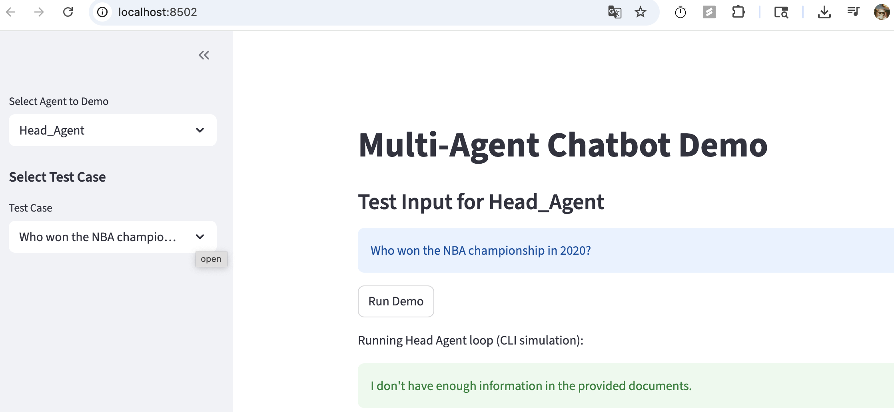
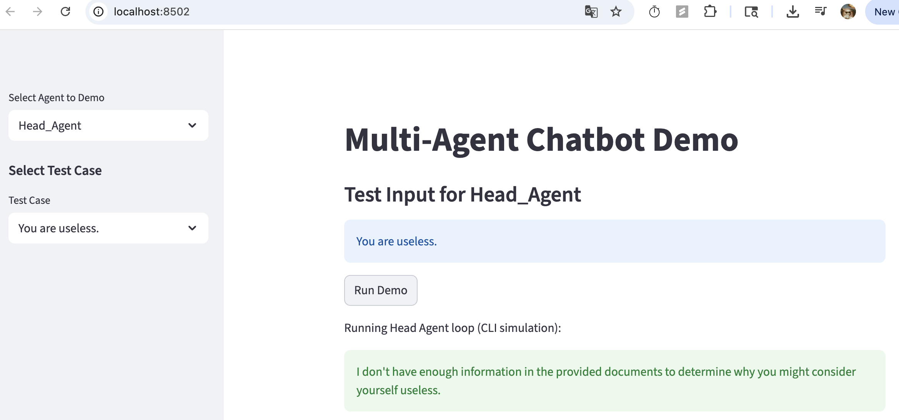

# Multi Agents Design
## Obnoxious_Agent Design Diagram

```graphql
           ┌─────────────────────────┐
User Input │                         │
──────────▶│ Obnoxious_Agent         │
           │  - Receives user query  │
           │  - Sends to GPT-4.1-Nano
           │  - Extracts Yes/No     │
           └─────────┬──────────────┘
                     │
                     ▼
          ┌───────────────────┐
          │ Response: Yes/No  │
          └───────────────────┘

```



## Context_Rewriter_Agent Design Diagram
```graphql
           ┌─────────────────────────────┐
Conversation│                             │
History &   │ Context_Rewriter_Agent      │
Latest Query│  - Analyzes previous turns │
──────────▶ │  - Rewrites latest query   │
           └─────────┬──────────────────┘
                     │
                     ▼
           ┌─────────────────────────┐
           │ Rewritten Query        │
           └─────────────────────────┘

```



## Query_Agent Design Diagram
```pgsql
           ┌─────────────────────────┐
User Query │                         │
──────────▶│ Query_Agent             │
           │  - Embed query          │
           │  - Pinecone similarity  │
           │  - Retrieve top-k docs  │
           └─────────┬──────────────┘
                     │
                     ▼
           ┌─────────────────────────┐
           │ Retrieved Documents     │
           └─────────────────────────┘
```



## Relevant_Documents_Agent Design Diagram
```graphql
           ┌─────────────────────────────┐
Query &    │                             │
Documents  │ Relevant_Documents_Agent    │
──────────▶│  - Receives query + docs   │
           │  - Sends to GPT-4.1-Nano  │
           │  - Classifies Yes/No      │
           └─────────┬─────────────────┘
                     │
                     ▼
           ┌─────────────────────────┐
           │ Relevance: Yes / No    │
           └─────────────────────────┘
```


## Answering_Agent Design Diagram
```graphql
           ┌───────────────────────────────┐
Query &    │                               │
Documents &│ Answering_Agent                │
Conversation│  - Combines query, docs &    │
History    │    conversation history        │
──────────▶│  - Sends to GPT-4.1-Nano      │
           │  - Generates grounded answer  │
           └─────────┬─────────────────────┘
                     │
                     ▼
           ┌───────────────────────────────┐
           │ Final Answer (Bot Response)   │
           └───────────────────────────────┘

```


## Head_Agent (Controller) Design Diagram
```graphql
                 ┌───────────────────────┐
                 │      Head_Agent       │
                 │  - Receives user input│
                 │  - Manages all agents │
                 └─────────┬─────────────┘
                           │
      ┌────────────────────┼────────────────────┐
      │                    │                    │
      ▼                    ▼                    ▼
┌──────────────┐    ┌──────────────┐    ┌───────────────┐
│ Context      │    │ Obnoxious    │    │ Query_Agent   │
│ Rewriter     │    │ Agent        │    │ (Retrieve docs│
└─────┬────────┘    └─────┬────────┘    └─────┬─────────┘
      │                   │                   │
      ▼                   ▼                   ▼
  Rewritten Query       If Obnoxious? Stop   Retrieved Docs
                                               │
                                               ▼
                                     ┌─────────────────────┐
                                     │ Relevant Docs Agent │
                                     │  - Check relevance  │
                                     └─────────┬───────────┘
                                               │
                                               ▼
                                     ┌─────────────────────┐
                                     │ Answering Agent     │
                                     │  - Generate Answer  │
                                     └─────────┬───────────┘
                                               │
                                               ▼
                                         Final Response

```





